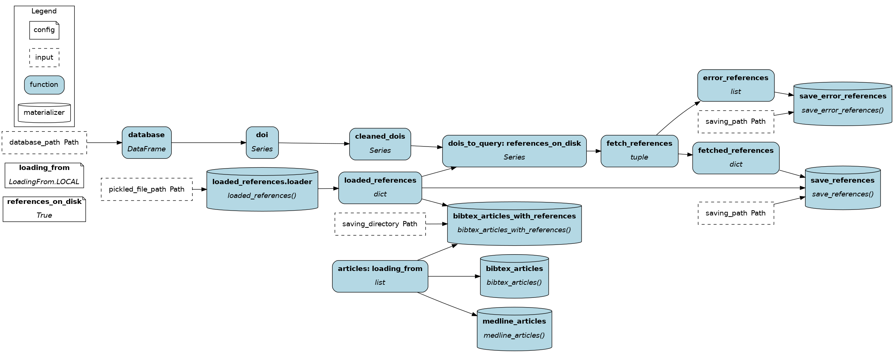
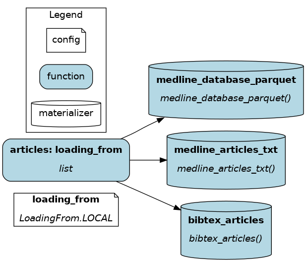

# motor-learning-network: Citation Network Analysis of the whole Motor Learning literature

<a target="_blank" href="https://cookiecutter-data-science.drivendata.org/">
    
</a>

## Description

Framework based on Directed Acyclic Graphs (DAGs) for the reproducible and robust generation of a citation network of every scientific publication of the motor learning literature until the year 2025. It relies on pixi for environment management, Apache Hamilton for the DAGs and DVC for data version control. The publication were extracted from Clarivate's Scopus, EBSCO's Academic Search Ultimate, MEDLINE (accessed through PubMed), and Web Of Science (Core Collection, Korean Journal Database, and BIOSIS Citation Index).



## Installation 

To install the environment:
```bash
pixi install
```

## Getting started

### Pulling the data (raw & processed) and the results.

Run the following command:
```bash
pixi run dvc pull
```

## Reproducing the pipeline

### Databases
Scopus, Web of Science, and EBSCO are subscription-based services, thus, you must access their online interfaces through your own means.Alternatively, you can use the files available in Data/Raw.

MEDLINE can be downloaded from PubMed. Run:
```bash
pixi run python get_pubmed_dataset.py
```

